<div align="center">



<br/>

### **Master console for an army of clawds**

<sub>one cockpit · one socket · three vendors · N parallel agents · zero friction</sub>

<br/>


<br/>

`[ idle ]` → `[ running ]` → `[ tool_use ]` → `[ approval ]` → `[ done ]` / `[ error ]`

<sub>six states · one pure reducer · every tile renders from a snapshot</sub>

</div>

---

<div align="center">


<sub>↑ what CLARMY does, in one loop : each clawd gets a tile, the tile tells the truth</sub>

</div>

---

## `~/` Why CLARMY

One coding agent in a terminal is magic. Ten of them, across three vendors, is a blur of windows, lost approvals and invisible spend. CLARMY is the war room:

- **One grid, every agent** : color-coded six-state tiles, patched live over a single WebSocket.
- **Three vendors, one cockpit** : Claude Code, OpenAI Codex and Gemini CLI side by side, metrics strictly separated.
- **Telemetry that tells the truth** : live cost includes **subagents**, context occupancy renders as an ASCII meter, vendor rate-limit windows show as quota gauges.
- **A self-aware fleet** : CLARMY ships its own MCP server, so any piloted session can inspect the fleet, spawn or kill siblings, and schedule crons.
- **Zero-key dev loop** : `COCKPIT_MOCK=1` replays JSONL fixtures through the real reducer.

---

## `%` Live telemetry

```
 CONTEXT                            COST
 129.8k / 1.0M tok          13.0%   so far         $316.58
 [███▍░░░░░░░░░░░░░░░░░]            tools used       7,382

 QUOTAS                     claude · MAX 20X
 5H      [████▊░░░░░░░░░░]    44%
 WEEKLY  [███▍░░░░░░░░░░░]    31%
 OPUS    [██████▎░░░░░░░░]    57%
```

- **Honest cost** : the live tailer also ingests nested `subagents/**/*.jsonl` transcripts (per-file offsets, `msg:req` dedup, per-record pricing by each message's own model). A session that fans out 10 readers shows what they actually burned.
- **Context meter** : occupancy of the current prompt, denominator from the model registry or Codex's own live `model_context_window`. Accent-tinted track, sub-cell eighth-block edge.
- **Quota gauges** : Claude windows from the same OAuth endpoint the CLI reads, Codex from its rolling rate-limit events. Cached, backoff-aware, never fabricated.

---

## `//` What's inside

- **Multi-provider orchestrator** : one `CliDriver` contract, three implementations. SDK sessions wrap `query()`; CLI sessions run in a real PTY with per-vendor transcript tailers.
- **Pure state machine** : every SDK message and tail patch becomes a `StateAction` fed to `reduce(snapshot, action)`. Tiles render from snapshots, nothing else.
- **Typed WS protocol** : both ends share `ws-protocol.ts`. Patches, not polls.
- **Fleet MCP server** : list the fleet, read any sibling's snapshot, spawn / kill, manage crons, pull usage. Ask one agent to summarize what the others did today and it can.
- **Focus · History · Metrics** : per-session drill-down (context meter, cost, diffs, todos), cross-vendor history, multi-area chart + heatmap + per-project / per-model breakdowns.
- **Cron scheduler** : recurring agent runs with model, effort and approval policy per job.
- **MCP · Skills · Plugins · Hooks pages** : browse everything wired into your machine.
- **PTY terminal** : node-pty + xterm.js, themed by the same accent tokens as the UI.
- **Theme engine** : dark / light, hot-swappable fonts, one accent color driving the whole cockpit with automatic contrast enforcement.

---

## `##` Architecture

```
                ┌───────────────────────────┐
                │         server.ts         │
                │ one Node process · :3010  │
                └─────────────┬─────────────┘
         ┌────────────────────┼────────────────────┐
         ▼                    ▼                    ▼
 ┌──────────────┐    ┌────────────────┐    ┌────────────────┐
 │ Next handler │◀──▶│   ws-server    │◀──▶│ SessionManager │
 │  app/ (RSC)  │    │ /ws broadcast  │    │ Map<id,Runner> │
 └──────┬───────┘    └───────┬────────┘    └───────┬────────┘
        ▼                    ▼                 ┌───┴───┐
 ┌──────────────┐    ┌────────────────┐       ▼       ▼
 │   browser    │───▶│ Zustand store  │   SDK runner  PTY runner
 │ tile islands │    └────────────────┘   query() ─▶  claude/codex/
 └──────────────┘                         reducer ─▶  gemini CLI +
                                          snapshot    tailers
```

Every session lives in exactly one of six states (`idle` · `running` · `tool_use` · `approval` · `error` · `done`), owned by the pure reducer in `src/lib/orchestrator/state-machine.ts`.

| Vendor | Binary   | Live metrics source                             | Models                             |
| ------ | -------- | ----------------------------------------------- | ---------------------------------- |
| Claude | `claude` | JSONL transcripts + nested `subagents/**` trees | Mythos · Opus 4.8 · Sonnet · Haiku |
| Codex  | `codex`  | rollout `token_count` events (window + usage)   | GPT-5.5 → GPT-5.2                  |
| Gemini | `gemini` | `logs.json` (no token telemetry upstream)       | Gemini 3 / 2.5                     |

---

## `$` Quick start

```bash
pnpm install
cp .env.example .env          # add ANTHROPIC_API_KEY=sk-ant-...
pnpm dev                      # → http://localhost:3010

# or, without any API key:
COCKPIT_MOCK=1 pnpm dev       # replays ./mocks/sessions/*.jsonl
```

| Command          | What it does                                     |
| ---------------- | ------------------------------------------------ |
| `pnpm dev`       | Custom Next + WebSocket server on `:3010`        |
| `pnpm typecheck` | TypeScript strict, no emit                       |
| `pnpm test`      | Vitest integration suite (`tests/integration/*`) |
| `pnpm build`     | Production build (`pnpm start` to serve)         |

---

## `{}` Conventions

Files under **300 lines** (split, don't grow) · no `any`, narrow `unknown` · no `console.log`, use `createLogger("scope")` · zod-validated API routes · WS protocol typed both ends. Adding a tile state is four type-enforced steps, documented in `CLAUDE.md`.

```
clarmy/
├─ server.ts                custom Next + WebSocket bootstrap
├─ src/
│  ├─ app/                  RSC pages + route handlers
│  ├─ components/           tiles, shell, views, overlays, terminal, ui
│  ├─ lib/
│  │  ├─ orchestrator/      SessionManager, runners, state-machine, crons
│  │  ├─ providers/         CliDriver + claude / codex / gemini drivers
│  │  ├─ claude-code/       transcript scanner, live tailer, pricing
│  │  ├─ quota/             vendor rate-limit windows
│  │  └─ shared/            types, model registry, ws protocol (zod)
│  └─ styles/               design tokens
├─ mocks/sessions/          JSONL fixtures for mock mode
└─ tests/integration/       vitest suites
```

---

<div align="center">

<sub>Built for operators who run coding agents like a fleet, not a toy.</sub>

<br/>

`pnpm dev` → `http://localhost:3010` → **unleash the army**

</div>
